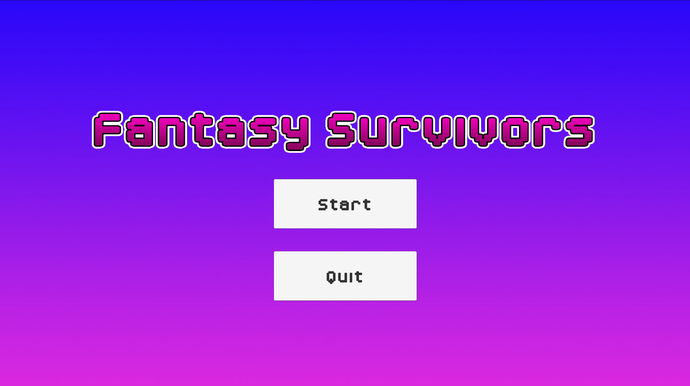
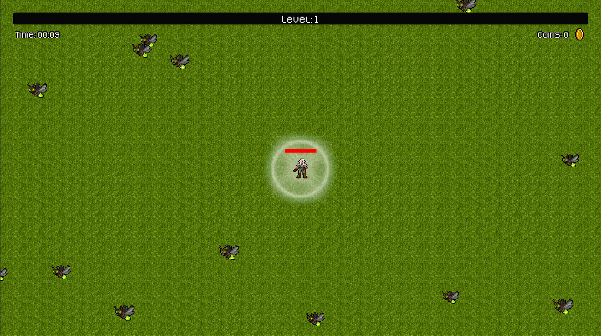

# Fantasy Survivors

A Unity game inspired by Vampire Survivors, where you must evade and combat enemies, gather experience and coins to advance in levels, and unlock enhancements and new weaponry to endure.






## Run Locally

Clone the project

```bash
  git clone https://github.com/alexup19/fantasy-survivors.git
```

Run in Unity

```bash
  Open Unity Editor and click the "Open" button and then "Add project from disk"
```


## How to Play

A random weapon will be assigned to you on each run. Weapons have cooldowns and are spawned automatically.

- Move using the WASD or arrow keys. 
- Attack using weapons to defeat enemies.
- Collect experience and coins dropped by monsters.
- Level up by collecting the required experience to upgrade or unlock weapons.
- Use coins to increase stats.
- Press the Escape key to pause the game.

## Demo

[Fantasy Survivors](https://alexup19.itch.io/fantasy-survivors) - Itch.io


## Acknowledgements

Based on [Vampire Survivors Style Game in Unity & C#](https://www.udemy.com/course/unity-vampire-survival/) course by [James Doyle](https://www.youtube.com/gamesplusjames)

